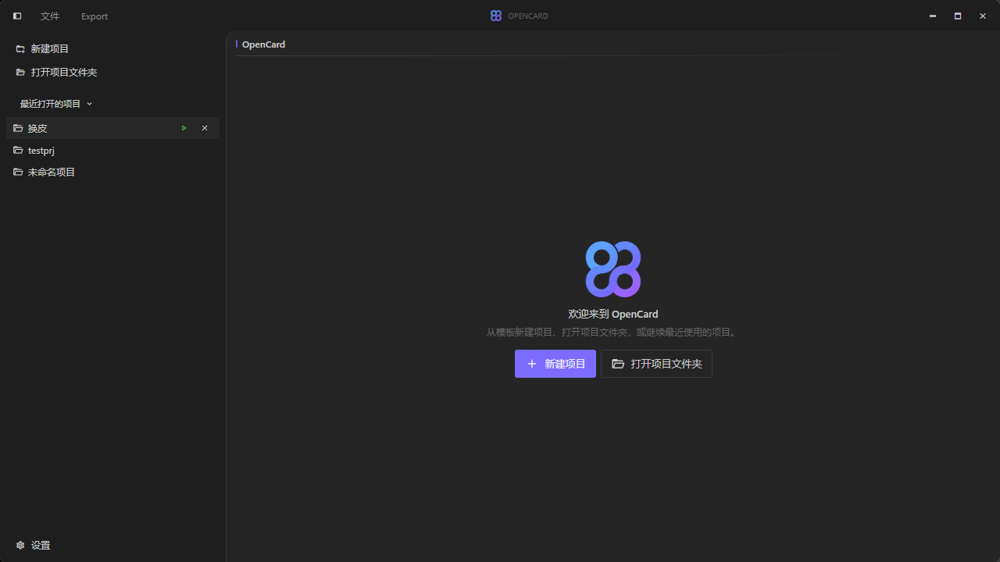

# OpenCard

A visual workspace for designing cards and creating reusable templates.

Built with Vue 3 and Tauri.

## Highlights

- Visual card editing with live preview
- Reusable project templates and template export
- Structured layers and property controls
- Light, dark, and customizable glass appearance

## Screenshots




## Development

```bash
cd opencard-app
npm install
npm run tauri dev
```
