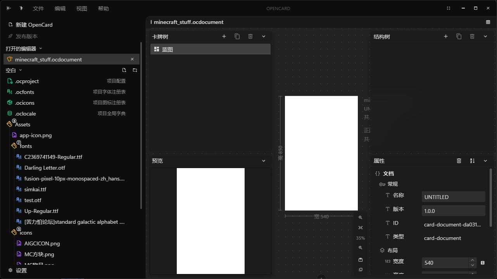
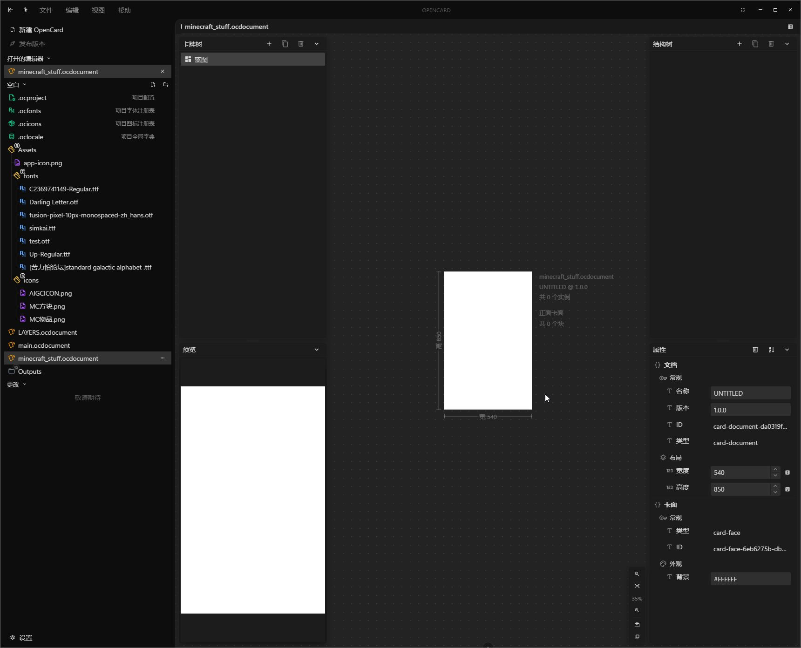
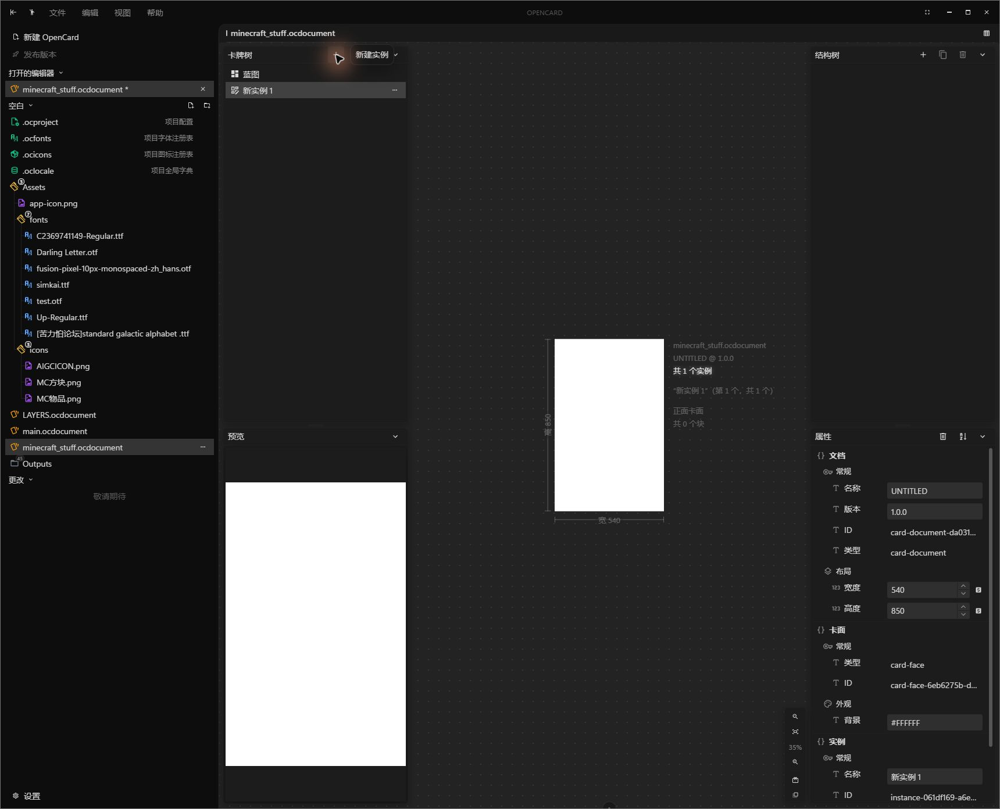
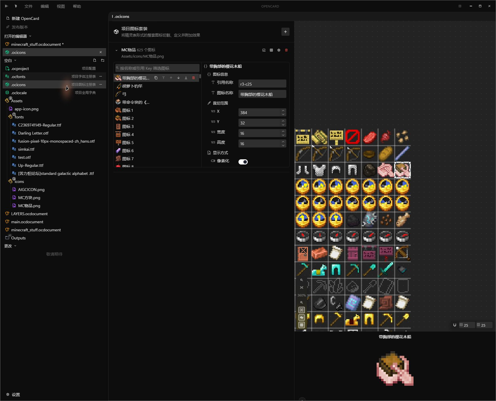
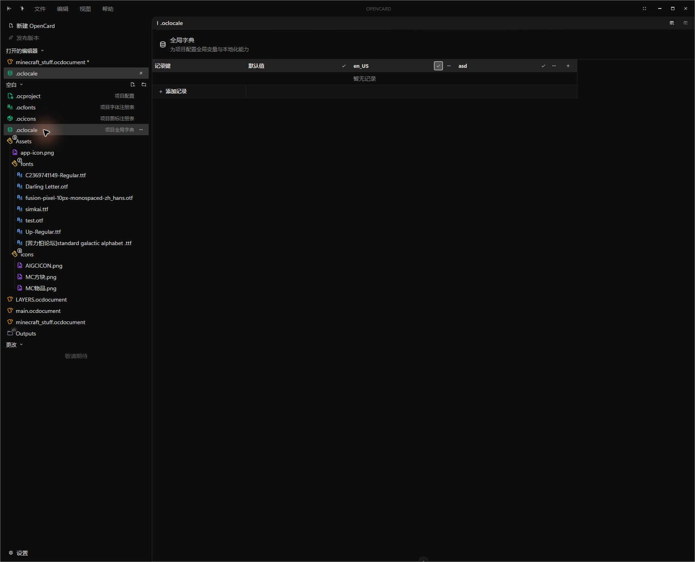
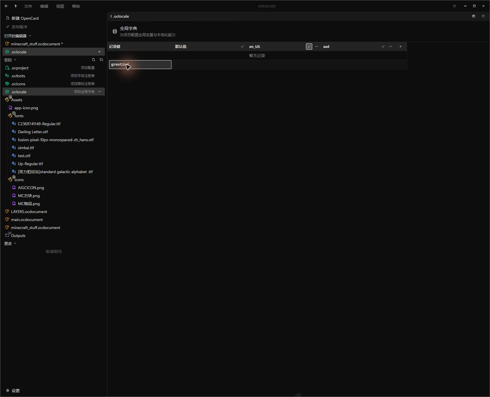

# OpenCard 0.3.2

OpenCard 是一个面向创作者的可视化卡牌工作台：你可以在项目中组织卡牌文档，用蓝图定义结构，再创建多个实例，最后通过画布、属性面板和资源工具完成视觉编辑。

它适合用来制作卡牌、角色卡、道具卡、桌游组件，以及任何需要“同一套版式 + 多份内容”的图文项目。

> 当前版本处于 **Early Access（早期体验）**。编辑、实例、资源和字典工作流已经可以实际使用，但发布与项目版本管理仍在开发中。请把项目文件和导出文件保存在可靠位置，并在升级前自行备份。

## 从一次编辑开始

### 1. 从工作区进入项目

左侧项目树用于定位项目文件，主区域用于打开当前文档。OpenCard 将文件组织、文档编辑和工具面板放在同一个工作区里，适合反复编辑同一套卡牌内容。



### 2. 先编辑蓝图，再生成实例

卡牌文档可以先作为蓝图使用。蓝图描述共享的结构和版式；当你需要填入具体内容时，创建实例即可保留统一设计，同时允许每张卡拥有自己的数据。



创建实例后，实例会出现在实例树中，并可以单独选择、编辑和管理。这样做适合批量制作同款卡牌，也方便在后续调整中保持整体一致。



### 3. 用画布和属性面板完成视觉细节

在编辑器中，你可以围绕卡牌结构逐层处理内容和外观，包括文本、图片、布局、颜色、字体以及实例覆写。共享部分留在蓝图中，单卡差异放在实例中。

## 管理项目资源

### 图标集

如果一张卡需要使用大量小图标，可以注册精灵图图标集，再在图标集编辑器中裁剪、排序和配置图标。裁剪结果可作为项目资源重复使用，避免每张卡重复处理图片。



### 全局字典

全局字典用于集中维护项目中的文本记录，例如名称、描述和可替换内容。把重复出现的文案放进字典后，修改内容时不必逐张卡搜索；字典表格也支持继续添加和整理记录。





## 已提供的能力

- 蓝图与实例：从共享结构创建多份卡牌实例
- 可视化编辑：画布、结构树和属性面板协同工作
- 项目字体与图标集：登记项目资源并在编辑器中复用
- 全局字典：集中维护项目文本内容
- 主题与界面设置：支持深色和浅色主题
- 项目导出相关流程：部分能力仍会随着 Early Access 版本继续完善

## Early Access 说明

0.3.2 的重点是让“组织项目 → 编辑卡牌 → 创建实例 → 管理资源”这条链路可以稳定体验。以下事项需要特别留意：

- 发布功能仍在开发中，当前版本不应被视为完整的发行管线。
- 项目版本管理尚未完成，版本号和历史管理不能替代外部备份或 Git 等版本控制工具。
- 文件格式和交互细节可能在后续版本调整；重要项目请保留可回退的副本。
- 这是桌面端工作台，不是在线协作服务；多人协作、云端同步等能力不在本版本承诺范围内。

## 开始开发

需要 Node.js、npm，以及 Tauri 2 的本地开发环境。进入应用目录后执行：

```bash
cd opencard-app
npm install
npm run tauri dev
```

常用命令：

```bash
# 启动 Vite 网页开发服务器
npm run dev

# 类型检查并构建前端
npm run build

# 运行测试
npm test
```

## 项目结构

```text
OpenCard/
├─ opencard-app/       # Vue + Tauri 应用
├─ docs/                # 项目文档与使用截图
└─ README.md            # 本说明
```

## 许可证与状态

本仓库当前以 Early Access 形式持续迭代。使用或分发前，请以仓库中的许可证文件和最新发布说明为准。
