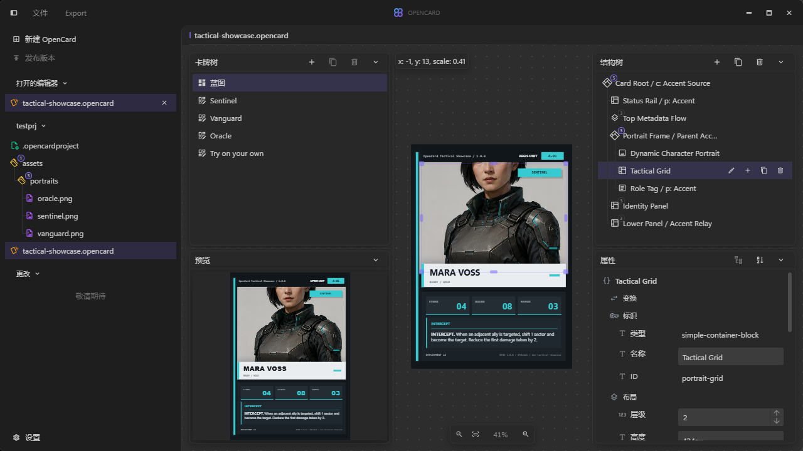
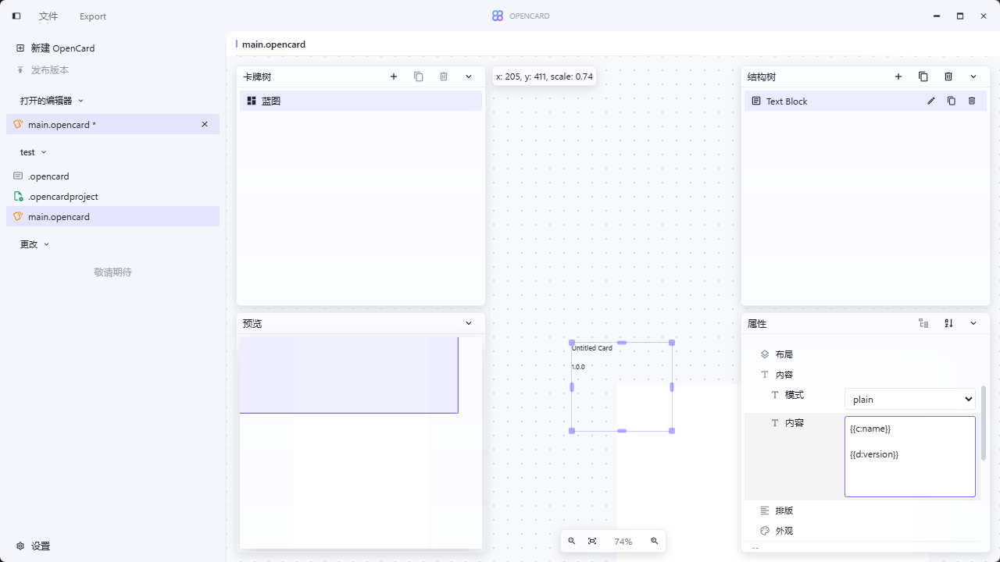

# OpenCard Early Access

A visual workspace for designing cards and creating reusable templates.

Built with Vue 3 and Tauri.

## Highlights

- Variable-driven content and reusable data binding
- Flexible typography and visual layout controls
- Reusable project templates and template export
- Project version management *(planned)*

## Screenshots






## Development

```bash
cd opencard-app
npm install
npm run tauri dev
```
