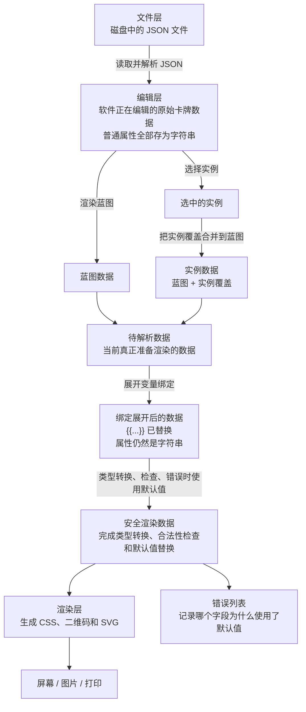

# 工程记录

## 卡牌数据渲染链路

```mermaid
flowchart TD
    A["文件层<br/>磁盘中的 JSON 文件"]
    B["编辑层<br/>软件正在编辑的原始卡牌数据<br/>普通属性全部存为字符串"]

    C1["蓝图数据"]
    C2["选中的实例"]
    C3["实例数据<br/>蓝图 + 实例覆盖"]

    D["待解析数据<br/>当前真正准备渲染的数据"]

    E["绑定展开后的数据<br/>{{...}} 已替换<br/>属性仍然是字符串"]

    F["安全渲染数据<br/>完成类型转换、合法性检查和默认值替换"]

    G["渲染层<br/>生成 CSS、二维码和 SVG"]
    H["屏幕 / 图片 / 打印"]
    I["错误列表<br/>记录哪个字段为什么使用了默认值"]

    A -->|"读取并解析 JSON"| B

    B -->|"渲染蓝图"| C1
    B -->|"选择实例"| C2
    C2 -->|"把实例覆盖合并到蓝图"| C3

    C1 --> D
    C3 --> D

    D -->|"展开变量绑定"| E
    E -->|"类型转换、检查、错误时使用默认值"| F

    F --> G
    G --> H

    F --> I
```

核心规则：编辑和保存时允许任意字符串；进入渲染器前统一转换，转换失败就使用默认值并记录错误，但不修改用户原始输入。
