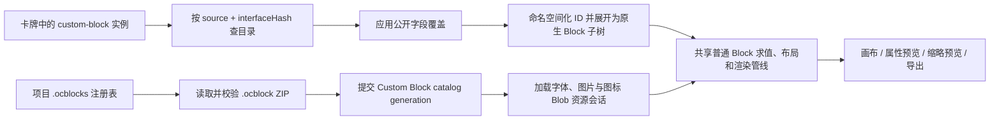

# PRD：Custom Block 可移植包、资源生命周期与富文本图标渲染

## 1. Introduction / Overview

OpenCard 当前已具备将容器导出为 `.ocblock`、在项目中注册 Custom Block，并在卡牌中实例化的基础能力，但导出、加载和渲染链路尚未形成可靠闭环：字体、图片和裁切图标可能未被正确收集或打包；部分资源 URL 会污染 Canvas，导致 `toBlob` 抛出 `Tainted canvases may not be exported`；资源加载状态由模块全局对象持有，重载时存在旧资源覆盖新资源或释放时机不明确的问题；Custom Block 内部错误又可能被完全过滤，造成静默缺失。

同一时期，普通文本块中的项目图标只在富文本编辑器内可见，在图标选择器预览、属性预览、主卡牌画布或缩略预览中可能消失。这不是 Custom Block 专属问题，而是图标节点序列化、目录解析和各渲染入口没有共享同一视觉契约造成的跨渲染器回归。

本需求以“导出后可立即重导入并完整渲染”为主闭环，同时重构 Custom Block 的导出边界、资源会话和错误隔离；普通 Block 的富文本图标渲染也纳入同一验收范围。实现完成前，包完整性、运行时生命周期和所有用户可见渲染入口必须同时通过。

## 2. Goals

- 让包含项目字体、项目图片、远程图片、Data URL 图片、裁切图标及嵌套 Custom Block 的容器可导出为自包含 `.ocblock`。
- 保证成功导出的 `.ocblock` 能立即被同一版本 OpenCard 重导入，并在脱离原项目资源后保持可渲染。
- 消除 Canvas 污染：所有参与图标图集合成的外部来源都先读取为受控字节，再通过同源 Blob URL 解码。
- 为每次项目/包加载建立明确的资源会话，避免并发重载、陈旧异步结果和 Blob URL/FontFace 泄漏。
- Custom Block 内部异常不能破坏宿主渲染器，也不能暴露内部 ID、路径、字段、绑定表达式或原始异常文本。
- 普通富文本图标在编辑器、选择器、属性预览、主画布、缩略预览和适用的 Markdown 渲染中使用同一解析与视觉契约。
- 输出并维护 Custom Block 渲染原理、与普通 Block 的差异、`.ocblock` 包结构和编辑器生命周期文档。

## 3. User Stories

### US-001：导出自包含 Custom Block 包

**Description:** 作为卡牌设计者，我希望导出的 Custom Block 包包含其实际使用的全部资源，以便在另一个项目中直接使用。

**Acceptance Criteria:**

- [ ] 导出分析递归遍历根 Block、所有容器子 Block 及已经注册的嵌套 Custom Block。
- [ ] 项目字体、项目内图片、允许的远程图片、Data URL 图片、已有 Custom Block 图片和已有 Custom Block 字体均被解析为字节并写入包内。
- [ ] 富文本 HTML 图标节点与 `[[icon:series/icon]]` 文本引用均被收集；实际用到的裁切区域被合成为包内 PNG 图集。
- [ ] `block.json.resources` 只索引真实写入 ZIP 的文件；ZIP 中不包含未索引资源。
- [ ] 同内容资源可按内容哈希去重，但不同资源不得因文件名相同而互相覆盖。
- [ ] 任一必需资源无法读取或合成时，导出失败并列出资源类型和用户可识别名称；不得生成看似成功但不完整的包。
- [ ] 导出成功后立即用生产导入路径读取刚生成的字节，验证清单、接口哈希、文件索引和引用完整性。
- [ ] 单元测试覆盖字体、图片、裁切图标、嵌套 Custom Block 和三类资源混合包。

### US-002：安全合成裁切图标图集

**Description:** 作为使用项目图标的设计者，我希望导出时稳定生成图标图集，不再遇到被污染 Canvas 无法导出的错误。

**Acceptance Criteria:**

- [ ] `asset://`、`file://`、HTTP(S)、Data URL 和已有包内资源都先被读取为 `Uint8Array`/`Blob`，再以应用创建的 Blob URL 交给图片解码器。
- [ ] 不依赖给 `` 设置 `crossOrigin="anonymous"` 来绕过无 CORS 响应或本地协议限制。
- [ ] 每个临时 Blob URL 在图片解码、绘制或失败处理完成后释放。
- [ ] 图集输出为真实 PNG 字节，`canvas.toBlob()` 返回空值时产生受控错误。
- [ ] 图标的裁切坐标、宽高、像素化、显示旋转和图集旋转语义在合成前后保持一致。
- [ ] 浏览器测试使用真实 PNG 和至少两个裁切图标执行导出，断言没有 Canvas security error。
- [ ] Verify in browser using browser control skill.

### US-003：校验 `.ocblock` 包的路径与资源身份

**Description:** 作为导入包的用户，我希望所有成功导出的包都能被导入，不会因路径大小写差异变成无效包。

**Acceptance Criteria:**

- [ ] ZIP 路径、清单资源路径、目录查找和运行时解析采用同一个规范化函数及大小写身份规则。
- [ ] `A.png` 与 `a.png`、`resources/Icons` 与 `resources/icons` 等仅大小写不同的路径在导出前被判定为冲突。
- [ ] 导出器不得创建一个会被导入器自身拒绝的包。
- [ ] 拒绝绝对路径、盘符路径、反斜杠逃逸、空段、`.`、`..`、重复规范路径和清单外文件。
- [ ] 保持现有压缩包总大小、解压总大小、条目数和单条目大小限制。
- [ ] 测试覆盖大小写冲突、路径穿越、缺失文件、未索引文件和导出后立即回导。

### US-004：以资源会话管理加载和释放

**Description:** 作为频繁切换项目或更新 Block 包的用户，我希望渲染器始终使用最新资源，并在资源失效时可靠释放旧对象。

**Acceptance Criteria:**

- [ ] 每次项目打开、Custom Block 目录重载或注册表变化创建一个带 generation ID 的资源会话。
- [ ] 会话拥有其创建的图片 Blob URL、图集 Blob URL、FontFace、加载任务和取消信号，并返回显式 `release()` 句柄。
- [ ] 新 generation 提交成功后再替换当前目录；旧 generation 的迟到结果不得写入新目录。
- [ ] 被替换、项目关闭、编辑器卸载或加载失败回滚时释放该会话创建的所有 Blob URL 和字体注册。
- [ ] 同一资源在一个会话中只创建一次运行时 URL；多个消费者共享该会话拥有的句柄。
- [ ] 单个字体、图片或图标系列加载失败时记录资源级问题，其余资源和 Block 继续可用。
- [ ] 并发测试覆盖快速连续两次重载、旧请求晚于新请求完成、部分失败和重复释放。

### US-005：隔离并脱敏 Custom Block 内部错误

**Description:** 作为卡牌设计者，我希望坏掉的 Custom Block 不会弄坏整张卡，同时能看到可操作但不泄密的错误。

**Acceptance Criteria:**

- [ ] Custom Block 展开、字段覆盖、绑定求值、资源解析或子树渲染失败时，只影响对应实例，不中止普通 Block 或其他 Custom Block。
- [ ] 画布为失败实例显示与现有设计系统一致的占位状态，不展示堆栈、原始 `Error.message`、内部 Block ID、文件路径、字段名、绑定表达式或令牌。
- [ ] 宿主按实例聚合成稳定错误类别，例如“组件包无效”“部分资源未加载”“组件内容无法渲染”。
- [ ] 开发诊断日志可保留结构化内部原因，但用户界面只能使用本地化错误码映射后的文案。
- [ ] 单个字体、图片或图标失败时优雅降级，并报告失败资源；不得因一个资源失败禁用整个 Custom Block。
- [ ] `CustomBlockRenderer` 组件测试覆盖成功、缺包、接口不匹配、部分资源失败和内部异常。
- [ ] Verify in browser using browser control skill.

### US-006：恢复普通富文本图标的全链路渲染

**Description:** 作为在普通文本块中插入图标的设计者，我希望图标在编辑时、预览时和最终卡牌上保持可见且一致。

**Acceptance Criteria:**

- [ ] TipTap 编辑器中的可视图标节点继续可插入、替换、删除和序列化。
- [ ] “添加图标”按钮或选择器中的图标预览正确显示裁切内容。
- [ ] 属性面板的富文本预览显示与编辑器相同的图标。
- [ ] 主卡牌画布、迷你卡牌预览和导出前渲染显示相同图标。
- [ ] Markdown 渲染在支持 `[[icon:series/icon]]` 的位置使用相同目录和样式解析。
- [ ] 图标缺失时显示稳定占位并产生可诊断问题，不显示原始机器引用作为正常结果。
- [ ] 所有消费者使用一个权威图标 token 解析器/序列化器和一个共享视觉类或组件契约，不再各自维护正则与类名枚举。
- [ ] 对比 `v0.3.4` 的回归用例覆盖编辑器可见但画布不可见的场景。
- [ ] Verify in browser using browser control skill，分别截图桌面画布、属性预览和图标选择器。

### US-007：保持 Custom Block 与普通 Block 的渲染边界

**Description:** 作为维护者，我希望两类 Block 共享基础渲染能力，但 Custom Block 的展开和资源命名空间不会侵入普通 Block。

**Acceptance Criteria:**

- [ ] 普通 Block 直接作为卡牌树节点参与属性求值、布局和渲染。
- [ ] Custom Block 实例仅持久化 `source`、`interfaceHash` 和公开字段覆盖；渲染前从目录解析包并展开为命名空间化的原生 Block 子树。
- [ ] 展开后复用普通 Block 的绑定、布局、富文本、图片和字体渲染管线，不维护第二套内容渲染器。
- [ ] 实例 ID、包内 Block ID 和 location ID 命名空间化，多个实例之间不得发生字段或 DOM 身份冲突。
- [ ] 包内不得残留未解析的 `custom-block`；嵌套 Custom Block 必须在导出物化阶段展开。
- [ ] 普通 Block 渲染不依赖 Custom Block 注册表是否成功加载。
- [ ] 架构文档包含两类 Block 的数据形态、渲染顺序、错误边界和资源来源对照。

### US-008：提供可靠的导出交互

**Description:** 作为导出 Custom Block 的用户，我希望导出过程中知道系统正在工作，并且不会因重复点击产生并发包写入。

**Acceptance Criteria:**

- [ ] 导出开始后对话框进入 busy 状态，主操作禁用且不能重复提交。
- [ ] 导出期间关闭、Esc 和遮罩点击遵循 `OcDialog` 的受控关闭策略，不能留下半完成状态。
- [ ] 成功时显示输出位置；失败时保留表单内容并显示本地化、脱敏的失败摘要。
- [ ] 资源失败摘要区分字体、图片和图标，允许用户定位源资源。
- [ ] 所有新增或修改文案同步更新全部支持语言。
- [ ] Verify in browser using browser control skill.

### US-009：交付包格式与生命周期文档

**Description:** 作为开发和排障人员，我希望有一份与代码和测试同步的说明，以便准确理解包内容、渲染原理及资源何时释放。

**Acceptance Criteria:**

- [ ] 文档列出 ZIP 目录、`block.json` 全字段、资源引用格式和一份可实际导入的完整示例。
- [ ] 文档说明 `.ocblock` 从注册、读取、校验、目录提交、实例化、展开、渲染、重载到释放的生命周期。
- [ ] 文档明确区分持久化数据、包内二进制、会话级 Blob URL/FontFace 和组件级渲染状态。
- [ ] 示例包由测试 fixture 或导出器生成并通过导入校验，避免手写示例与实现漂移。
- [ ] 文档说明 Custom Block 与普通 Block 的相同点和不同点，并列出每类错误应进入用户界面还是开发日志。

## 4. Functional Requirements

- **FR-1:** `.ocblock` 必须是 ZIP 容器，根目录包含唯一的 `block.json`，资源仅位于 `resources/fonts/`、`resources/images/` 和 `resources/icons/`。
- **FR-2:** `block.json.type` 必须为 `opencard-custom-block`，当前 `schemaVersion` 必须为字符串 `"1"`。
- **FR-3:** 清单必须包含 `key`、`name`、`interfaceHash`、`root`、`publicFields`、`resize`；`description` 和 `resources` 可选。
- **FR-4:** `root` 必须是可解析的原生 `CardBlock`，所有 Block ID 和 location ID 非空且在包内唯一，不得包含未展开 `custom-block` 或编辑器专用 `packaged` 状态。
- **FR-5:** `publicFields` 只能引用根 Block 的 `additionalFieldDefinition`，字段类型和默认值必须一致；字段 Key 大小写不敏感唯一。
- **FR-6:** `interfaceHash` 仅由按 Key 排序的公开字段 `{ key, fieldType }` 和 `resize` 计算，标题和默认值不参与哈希。
- **FR-7:** 每个资源索引项必须对应 ZIP 中一个文件，每个 ZIP 资源文件必须被索引；规范路径大小写不敏感唯一。
- **FR-8:** 图片持久化引用必须改写为 `ocblock:<package-key>/<resource-path>`；字体改写为会话可解析的包字体族；图标改写为包级 series/icon 身份。
- **FR-9:** 所有远程资源采集必须具备协议白名单、远程资源策略、超时、取消、MIME 校验、单资源大小和累计大小限制。
- **FR-10:** 图标图集输入必须来自受控字节/Blob URL，禁止直接把不可信协议 URL 画入可导出 Canvas。
- **FR-11:** 资源加载必须返回会话对象或等价显式所有权句柄，禁止继续以无所有者的模块全局集合管理 Blob URL 和 FontFace。
- **FR-12:** 目录替换必须是 generation-aware 的原子提交，陈旧 generation 不得修改当前运行时目录。
- **FR-13:** 资源释放必须幂等，并在项目切换、目录重载、编辑器销毁、失败回滚时执行。
- **FR-14:** Custom Block 展开错误必须在实例边界捕获，生成脱敏宿主问题；不得完全过滤所有内部问题，也不得直接透传内部问题。
- **FR-15:** 普通富文本与 Custom Block 展开后的富文本必须共享图标 token 解析、目录查找和 CSS/组件视觉契约。
- **FR-16:** Block 树递归遍历、映射和 ID 命名空间化必须由 `entities/card/tree.ts` 或同一领域边界下的共享 API 提供。
- **FR-17:** 导出编排不得继续由大型编辑器组件直接拥有；组件只负责收集用户输入和触发应用服务。
- **FR-18:** 建议将 UI 编排提取为 `useCdeCustomBlockExport`，将收集、物化、清单构建、归档、自回导验证和写盘放入 workspace/application service。
- **FR-19:** `CustomBlockExportDialog` 必须使用 `OcDialog`，并实现 busy、重复提交防护和受控关闭。
- **FR-20:** Custom Block 渲染样式必须使用真实存在的 foundation token；不得引用未定义的 `--oc-color-text-muted`、`--oc-color-surface-subtle`、`--oc-border-width-default` 或 `--oc-color-border-warning`。
- **FR-21:** 图标目录样式生成必须区分 Vue camelCase style 对象和 DOM `style.setProperty()` 的 kebab-case CSS 属性，不得混用键格式。
- **FR-22:** 用户可见错误和对话框文案必须通过 i18n 错误码映射，不得显示原始英文 `Error.message` 或浏览器原生内部标签。
- **FR-23:** 实现完成时必须更新 `opencard-app/RELEASE_NOTES.md`，以用户可见结果描述修复。
- **FR-24:** 发布门槛为包完整性、资源生命周期和全部 UI 渲染入口同时通过，不接受只修复其中一处的阶段性结果作为完成。

## 5. Non-Goals / Out of Scope

- 不在 schema v1 中加入脚本、插件、任意 HTML 执行或自定义渲染代码。
- 不允许 `.ocblock` 运行时回读原项目绝对路径、用户本地文件或未打包的远程依赖。
- 不新增 Custom Block 专属文本、图片、字体或图标渲染器。
- 不改变普通 Block 的持久化模型或现有卡牌文档 schema。
- 不在本需求中设计在线 Block 市场、签名发布、自动更新或跨网络依赖解析。
- 不把所有资源失败升级为整包不可用；只有清单、结构、引用完整性或接口契约失败才阻止目录注册。
- 不通过隐藏错误、吞异常或显示原始机器引用来定义“降级成功”。
- 不为已移除的旧字体 registry 结构添加兼容解析。

## 6. Design Considerations

### 用户反馈层级

| 状态 | 画布表现 | 用户信息 | 开发诊断 |
| --- | --- | --- | --- |
| 包结构/接口无效 | 实例占位 | 组件包无效或版本不兼容 | 原始校验码、包路径、堆栈 |
| 单个资源失败 | 其余内容继续，失败资源占位/字体回退 | 部分资源未加载，并按类型汇总 | 资源 Key、来源、底层错误 |
| 子树渲染异常 | 仅该实例占位 | 组件内容无法渲染 | 内部 Block ID、字段和堆栈 |
| 普通图标缺失 | 稳定图标占位 | 必要时在问题面板提示图标缺失 | series/icon 身份与目录状态 |

### 导出对话框

- 保留现有字段暴露、名称、Key、描述和输出位置工作流。
- 主操作开始后显示进行中状态，禁用所有会改变导出输入的控件。
- 失败摘要按“字体 / 图片 / 图标 / 包结构”归类，避免用一整段底层异常要求用户猜测。
- 不新增 feature 级魔法尺寸、颜色或动画值；使用 `OcDialog` 与 foundation token。

### 富文本图标视觉契约

- 共享契约负责背景图、裁切区域、背景尺寸、旋转、像素化和缺失态。
- 编辑器节点可拥有编辑交互状态，但不能另写一套图标裁切样式。
- shell、属性面板、卡牌画布和缩略预览不得通过手工枚举消费者 class 来获得图标样式。

## 7. Technical Considerations

### Custom Block 渲染原理



Custom Block 本身不是一种独立内容渲染技术。卡牌文档中的 `custom-block` 是一个轻量引用实例；运行时先解析对应包，将公开字段覆盖应用到包内根节点，再为整棵树改写身份并展开成现有原生 Block。展开之后，文本、Markdown、图片、容器和形状继续走普通 Block 的渲染逻辑。

### 与普通 Block 的区别

| 维度 | 普通 Block | Custom Block |
| --- | --- | --- |
| 卡牌内持久化 | 保存完整 Block 属性和子树 | 保存 `source`、`interfaceHash`、实例属性和公开字段覆盖 |
| 渲染前处理 | 直接进入求值和布局 | 查包、校验接口、覆盖字段、命名空间化、展开后再进入共享管线 |
| 资源来源 | 项目资源目录或允许的远程来源 | `.ocblock` 包内自包含资源，经会话映射为运行时 URL/字体 |
| 身份作用域 | 项目卡牌树 | 包定义身份 + 实例命名空间，避免多实例冲突 |
| 错误边界 | 单个原生 Block/字段 | 包加载、接口校验、资源会话、实例展开和展开后原生渲染 |
| 编辑语义 | 直接编辑所有字段 | 只编辑对外公开字段；定义内部结构由包提供 |

### `.ocblock` ZIP 目录实例

```text
example-badge.ocblock
├── block.json
├── resources/fonts/4f7c...9a2b.woff2
├── resources/images/12ab...78ef.png
└── resources/icons/98cd...32aa.png
```

### 当前 schema v1 的完整 `block.json` 结构实例

以下示例展示当前清单全部顶层字段、三类资源索引、公开字段、resize 策略和一个含富文本及图片的原生 Block 子树。哈希和资源文件名为示意值；正式文档中的 fixture 必须由实现生成并通过导入器验证。

```json
{
  "type": "opencard-custom-block",
  "schemaVersion": "1",
  "key": "example-badge",
  "name": "Example Badge",
  "description": "Badge with packaged font, image and cropped icon",
  "interfaceHash": "d9b1d3a7f95aea40cc27784955ed1fcad4d25f74434c5751edab64bfe93e1c7b",
  "root": {
    "id": "badge-root",
    "name": "Badge Root",
    "type": "simple-container-block",
    "width": "320px",
    "height": "120px",
    "background": "#ffffff",
    "additionalFieldDefinition": {
      "title": {
        "fieldType": "string",
        "title": "Title"
      }
    },
    "title": "<p>Example <span data-oc-icon-path=\"ocblock-example-badge/star\"></span></p>",
    "children": [
      {
        "location": {
          "id": "badge-image-location",
          "type": "simple-container-location",
          "anchor": "lc",
          "x": "16px",
          "y": "0px"
        },
        "block": {
          "id": "badge-image",
          "name": "Badge Image",
          "type": "image-block",
          "width": "72px",
          "height": "72px",
          "image": "ocblock:example-badge/resources/images/12ab345678ef.png",
          "fit": "contain"
        }
      },
      {
        "location": {
          "id": "badge-text-location",
          "type": "simple-container-location",
          "anchor": "cc",
          "x": "40px",
          "y": "0px"
        },
        "block": {
          "id": "badge-text",
          "name": "Badge Text",
          "type": "text-block",
          "content": "<p>Example <span data-oc-icon-path=\"ocblock-example-badge/star\"></span></p>",
          "fontFamily": "OpenCardCustomBlock-example-badge-heading",
          "fontSize": "24px",
          "color": "#111111"
        }
      }
    ]
  },
  "publicFields": [
    {
      "key": "title",
      "fieldType": "string",
      "title": "Title",
      "defaultValue": "<p>Example <span data-oc-icon-path=\"ocblock-example-badge/star\"></span></p>"
    }
  ],
  "resize": {
    "widthLocked": true,
    "heightLocked": true
  },
  "resources": {
    "fonts": [
      {
        "key": "heading",
        "name": "Example Heading",
        "source": "resources/fonts/4f7c9a2b.woff2"
      }
    ],
    "images": [
      {
        "key": "12ab345678ef",
        "source": "resources/images/12ab345678ef.png"
      }
    ],
    "iconSeries": [
      {
        "name": "Example Badge Icons",
        "key": "ocblock-example-badge",
        "source": "resources/icons/98cd543232aa.png",
        "grid": {
          "snapToGrid": false,
          "rows": 1,
          "columns": 1,
          "pixelated": false
        },
        "icons": [
          {
            "iconKey": "star",
            "name": "Star",
            "x": 0,
            "y": 0,
            "width": 32,
            "height": 32,
            "pixelated": false,
            "rotation": 0,
            "atlasRotation": 0
          }
        ]
      }
    ]
  }
}
```

### `.ocblock` 在编辑器中的生命周期

1. **注册：** 项目 `.ocblocks` 保存项目相对 `.ocblock` 路径；路径以大小写不敏感身份去重。
2. **读取：** 文件系统读取 ZIP 字节，先执行压缩包大小和中央目录预检，再解压到只读文件 Map。
3. **校验：** 解析 `block.json`，校验 schema、原生 Block 树、公开字段、资源索引、引用和 `interfaceHash`。
4. **准备资源：** 从包内字节创建会话级 Blob URL，加载 FontFace，建立包图片和图标 series 的运行时目录。
5. **提交目录：** 仅当 generation 仍为最新且必要校验成功时，原子替换当前 Custom Block catalog/resource session。
6. **实例化：** 用户添加 Custom Block 时，卡牌只保存包来源、接口哈希、实例身份和公开字段值。
7. **展开：** 每次渲染管线构建时解析实例，应用字段覆盖，命名空间化所有内部 Block/location ID，并物化为原生 Block 子树。
8. **渲染：** 展开子树进入与普通 Block 相同的属性求值、布局和视觉渲染；资源引用由当前会话解析。
9. **重载：** 注册表或包变化触发新 generation；旧目录继续服务当前画面，直到新 generation 成功提交。
10. **释放：** 新会话接管后释放旧 Blob URL/FontFace；项目关闭、编辑器卸载或准备失败时也释放对应会话，操作必须幂等。

### 资源所有权

| 数据/对象 | 所有者 | 创建时机 | 释放时机 |
| --- | --- | --- | --- |
| `.ocblock` ZIP 字节与文件 Map | 当前 catalog generation | 注册表加载与包读取 | generation 被替换或项目关闭 |
| 图片/图集 Blob URL | 资源会话 | 包校验后准备资源 | 会话替换、关闭或失败回滚 |
| FontFace 与字体 Blob URL | 资源会话 | 字体字节加载 | 会话替换、关闭或失败回滚 |
| 展开的原生 Block 子树 | 单次渲染派生状态 | 实例求值/渲染 | 对应计算失效或组件卸载 |
| 导出临时 Blob URL/Canvas | 单次导出任务 | 图标图集合成 | 每张图解码后或任务 finally |

### 推荐模块边界

- `entities/card/tree.ts`：唯一 Block 树遍历、映射、收集和命名空间化 API。
- 富文本/图标共享模型：唯一 token 解析器、序列化器和 DOM 节点识别逻辑。
- workspace custom block export service：资源收集、嵌套物化、清单构建、ZIP、自回导校验和写盘。
- custom block resource session：generation、取消、Blob URL、FontFace、目录提交和释放。
- `useCdeCustomBlockExport`：编辑器 UI 状态与应用服务之间的薄编排层。
- `CustomBlockRenderer`：实例边界、加载态、占位态和脱敏错误呈现，不拥有底层资源生命周期。

### 测试与验证矩阵

| 场景 | 单元/组件 | 集成 | 浏览器 |
| --- | --- | --- | --- |
| 导出后立即重导入 | 必须 | 必须 | 必须 |
| 大小写路径冲突 | 必须 | 必须 | 可选 |
| 真实 PNG 图集合成 | 必须 | 必须 | 必须 |
| 字体/图片/图标独立失败 | 必须 | 必须 | 必须 |
| generation 并发与旧资源释放 | 必须 | 必须 | 可选 |
| 普通富文本图标各入口 | 组件必须 | 必须 | 必须截图 |
| 嵌套 Custom Block 导出回导 | 必须 | 必须 | 必须 |
| Custom Block 脱敏错误 | 组件必须 | 必须 | 必须 |

## 8. Success Metrics

- 100% 由当前导出器成功生成的 `.ocblock` 均能被当前导入器立即读回。
- 测试矩阵中的字体、图片和裁切图标在移除原项目资源访问后仍能从包内加载。
- 真实浏览器导出测试中 Canvas taint 错误为 0。
- 连续重载压力测试中陈旧 generation 提交次数为 0，最终释放后未回收 Blob URL 和 FontFace 数为 0。
- Custom Block 内部异常导致整张卡渲染失败的测试用例数为 0，用户界面泄露内部 ID、路径、字段或堆栈的用例数为 0。
- 普通富文本图标在编辑器、选择器、属性预览、主画布和缩略预览的视觉一致性用例通过率为 100%。
- `npm run build`、`npm run lint:ui` 和相关 Vitest 测试全部通过；全量测试中的既有并发超时若仍存在，必须单独记录并验证非本需求确定性回归。

## 9. Open Questions

- 资源级错误是否需要进入现有问题面板，还是只在 Custom Block 实例占位和导出结果中展示；建议优先复用现有问题聚合能力。
- FontFace 从 `document.fonts` 删除在目标 WebView 版本上的行为需要实测；若平台不支持可靠删除，会话仍须回收 Blob URL，并使用 generation 唯一字体族避免旧字体被复用。
- 远程资源单文件和累计大小上限应与现有 `.ocblock` 128 MiB 压缩、512 MiB 解压限制协调；实现前确定更严格的采集上限和超时值。
- 包内资源是否在未来增加内容 MIME 和哈希字段不属于 schema v1 必需项；若要加入必须提升 schema 或保持向后可选并补充兼容测试。
- Markdown 图标支持范围需要以当前产品允许的 Markdown 字段为准，但任何已支持入口都必须共享同一图标目录和视觉契约。
